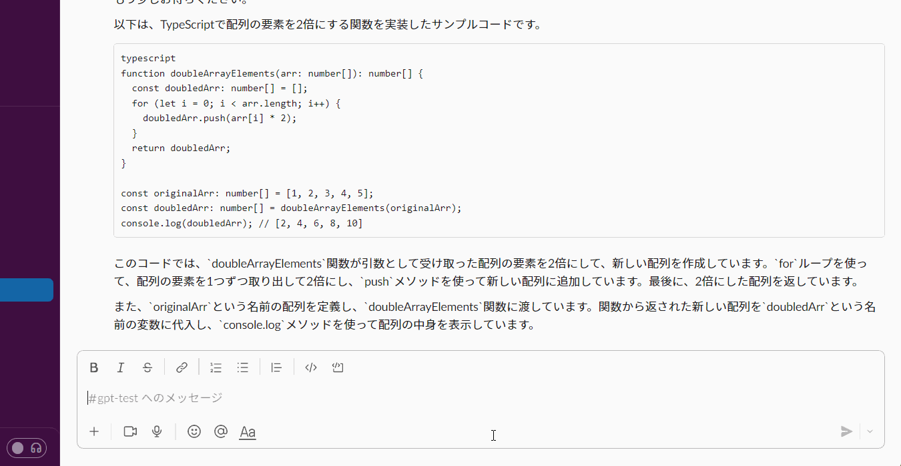
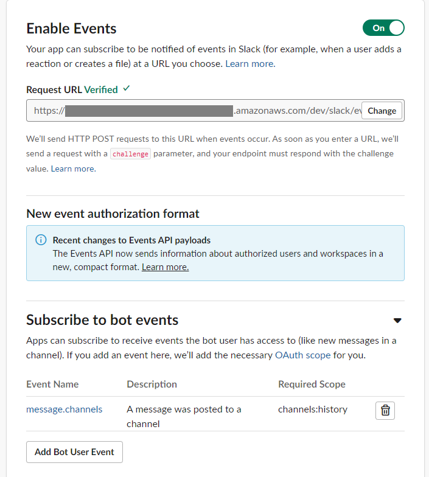

# gpt-slack-bot-serverless

- ServerlessでOpenAIのAPIと連携するSlackアプリです。
- [Serverless Framework](https://www.serverless.com/)を使ってAWSにデプロイします。


## :mag:Demo



## :rocket:Feature

- このSlackアプリをインストールしたチャンネルでメッセージを投稿すると、そのメッセージをOpenAIのAPIにリクエストし、その回答を同じチャンネルに投稿します。
- OpenAIのモデルは「gpt-3.5-turbo」です。
- メッセージを受け付けると「ちょっとお待ちください」と返答します。
- APIからのレスポンスが来ない場合、環境変数INTERVAL_SECONDSで指定した時間間隔で「もう少しお待ちください」とメッセージを送ります。
- AWS LambdaがTimeoutする前に、「すみません、時間切れです。」とメッセージを送ります。

## :gear:Requirements

- Node.js v16 or later
- Serverless Framework

```
npm install -g serverless
```

## :technologist:Setup&Usage

Slack Appを新規作成し、下記を取得する。
- Signing Secret
- Bot User OAuth Token

本リポジトリをcloneする。
```
git clone https://github.com/d16sekine/gpt-slack-bot-serverless.git
```


下記コマンドで.envファイルを作成し、環境変数を設定する。

```
cp .env_example .env
```

### 環境変数
|name|説明|
|---|---|
|AWS_PROFILE_NAME|deploy時のAWSプロファイルの指定|
|TIMEOUT_SECONDS|AWS LambdaのTimeout時間の値（秒）|
|INTERVAL_SECONDS|APIからのレスポンス待ちのときに、ことわりメッセージをslackに送る時間間隔（秒）|
|SLACK_SIGNING_SECRET|SlackのSigning Secretの値|
|SLACK_BOT_TOKEN|SlackのBot User OAuth Tokenの値|
|OPENAI_API_KEY|OpenAIのAPIキー|

下記コマンドでAWSにdeployする
```
yarn deploy
```

deployが完了すると、下記のようなendpointが生成される。
```
 https://xxxxxxx.execute-api.ap-northeast-1.amazonaws.com/dev/slack/events  
```

続いて、Slack App側で下記を設定する。
- OAuth & Permissions
  - Scopesで下記を許可
    - channels:history
    - chat:write


- Event Subscriptions
  - Request URLに、deployで作成したendpointを設定
  - Subscribe to bot eventsで下記を許可
    - message.channels



本Slack Appと連携したいチャンネルに、本Slack Appをインストールする。

該当チャンネルでメッセージを投稿し、回答が返ってくれば動作確認OKです。


## :bulb:License
This project is licensed under the terms of the MIT license.


